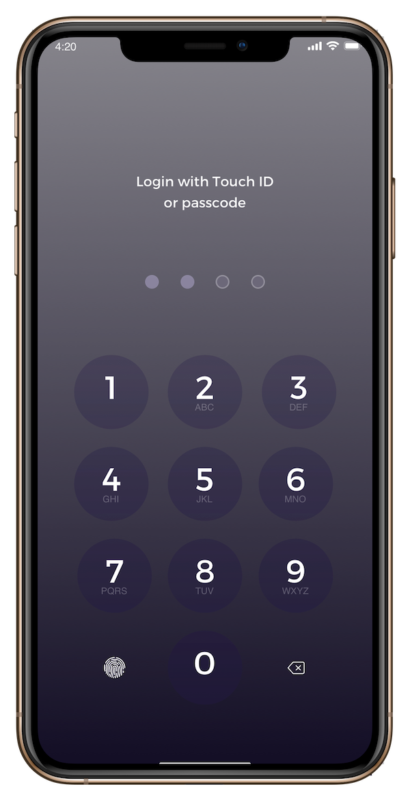
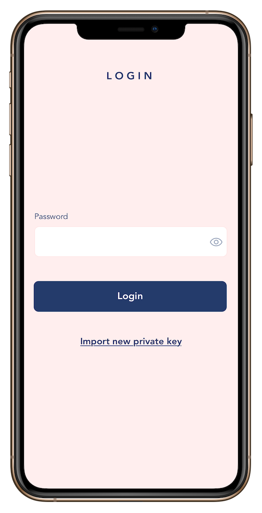
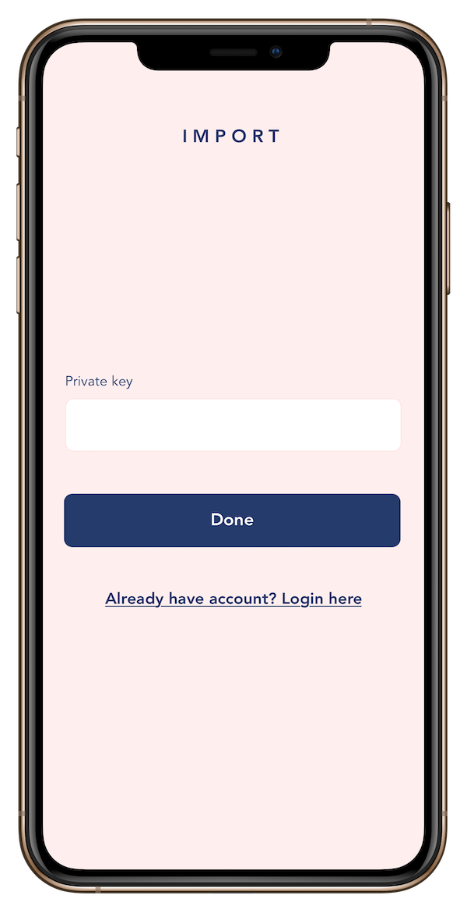
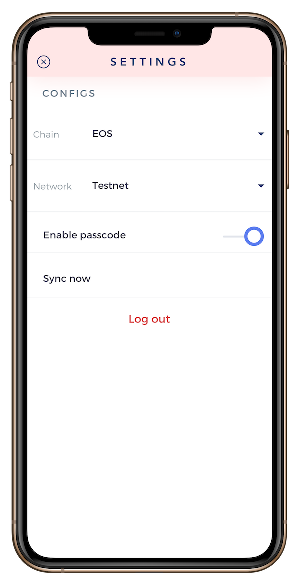

# blockpass-smart-contract

This is the smart contract of blockpass application. To download, follow the links below:

## Screenshots

   

## Created & Maintained By

[Trong Dinh](https://github.com/trongdth) ([@trongdth](https://www.twitter.com/trongdth))

> If you found this project helpful or you learned something from the source code and want to thank me, consider buying me a cup of :coffee:
>
> * [Ethereum address: 0x9a1592C20A15f99AbB6b69E199f38D50Fa8372Ac]
> * [EOS account: zcryptoman1z]

## Getting Started
### How to build:
- cd EOS/blockpass
- mkdir build
- cd build
- cmake ../
- make
- cp blockpass.abi blockpass.wasm ../

### How to deploy:
- cleos -u {eos_api_endpoint} set contract {contract_name} {path_to_eos_blockpass} -p {account_name}@active

If you have any problem, don't hesitate to contact us at: trongdinh@mroomsoft.com